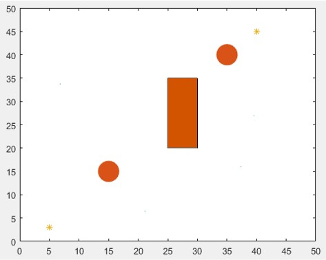

## Path-Planning-Strategies in Robotic Swarms
The multi robot path planning is an extensively researched field. Here, we implemented two strategies that can be implemented on a multi-robot system to reach from a starting position to a goal position avoiding collisions with obstacles and surrounding robots. The major features which are required for completing such a task are Formation Control and Obstacle Avoidance. Further features can be taken into account depending upon the complexity of the environment
## Evolutionary Algorithm based strategy
This strategy is divided into Global Path Planning and Local Path Planning
# Global Path Planning
In this, the details of the environment filled with obstacles is considered. Voronoi Tessellation of this environment provides us with the network of safe routes the robotic swarm can take to avoid obstacles. Then Dijkstra's algorithm was implemented to obtain the shortest safe path to the target from initial position

